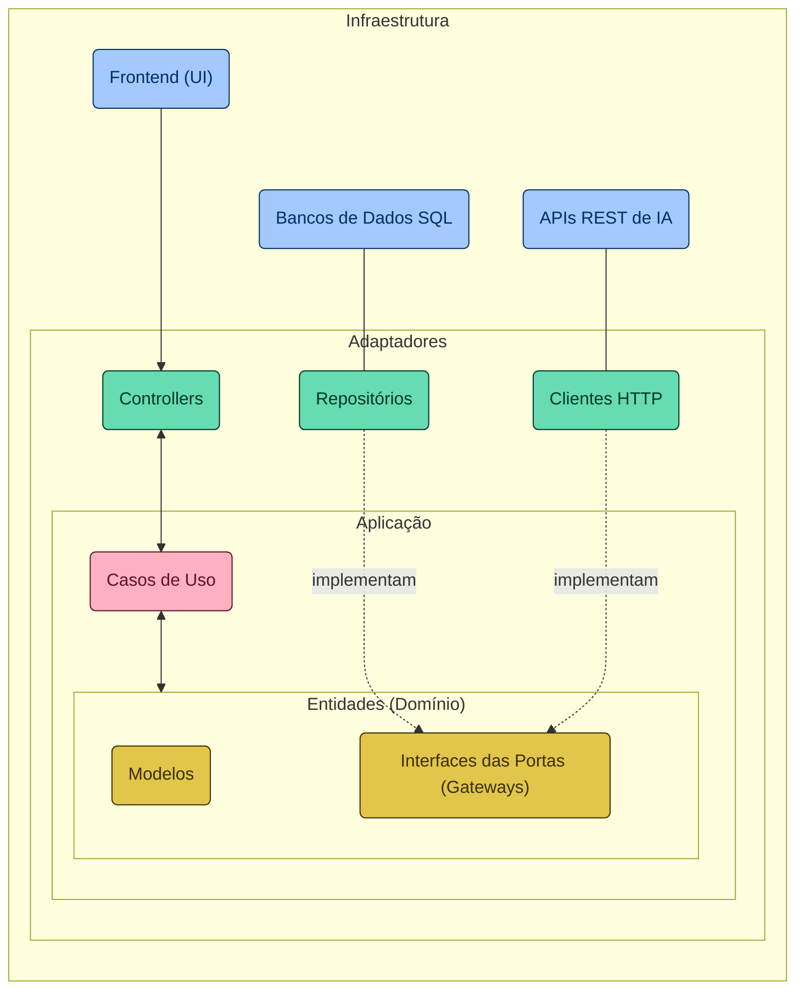

# Santander Dev Week 2024

## 📚 Sobre o Projeto

Neste repositório, você encontrará o código-fonte de uma REST API e seu respectivo Frontend (pasta `/docs`), desenvolvidos durante a Santander Dev Week 2024, fruto de uma colaboração entre a DIO e o Santander. Este projeto, construído com Java 21 e Spring Boot 3, é o resultado de quatro dias de lives, com um propósito incrível: 

> [!NOTE]
> Objetivo: "Permitir que os usuários conversem com os personagens importantes do mundo de World of Warcraft (WoW)".

Para isso, utilizamos algumas das mais recentes Inteligências Artificiais (IAs) Generativas, possibilitando que nossa API "entenda" a personalidade única de cada campeão para criar interações que capturam sua essência, tornando cada conversa uma experiência única.

### Tecnologias utilizadas

> [!TIP]
> Caso queira reproduzir este projeto, você terá os seguintes pré-requisitos:
> - Java 21 **[JDK 21](https://www.oracle.com/br/java/technologies/downloads/#java21)** (versão LTS do Java na data das lives);
> - IDE **[IntelliJ IDEA Community Edition](https://www.jetbrains.com/idea/download)** 
> - Serviços AWS (para publicar a API REST na Nuvem usando o [AWS Elastic Beanstalk](https://aws.amazon.com/elasticbeanstalk);
> - Conta na OpenAI e Google para integração com os modelos [GPT](https://platform.openai.com/docs/api-reference/chat/create) e [Gemini](https://ai.google.dev/tutorials/rest_quickstart#text-only_input).
>

## 🏛️ Arquitetura do Projeto (Retirado do repositório original da Dev Week)

### Diagrama Arquitetural
A seguir, apresento o diagrama arquitetural do projeto (escrito com [Mermaid](https://mermaid.js.org/)), destacando a separação das responsabilidades entre as camadas. Desde a interface de usuário até os mecanismos de interação com sistemas externos, passando por adaptadores, casos de uso e as entidades centrais do domínio, cada elemento é estrategicamente posicionado para reforçar a modularidade, a escalabilidade e a manutenibilidade do sistema. Esta estrutura facilita a compreensão de como os componentes colaboram para a realização dos objetivos do software, alinhando-se aos princípios da [Clean Architecture](https://blog.cleancoder.com/uncle-bob/2012/08/13/the-clean-architecture.html) (inclusive nas cores dos elementos).



### Estrutura de Diretórios

Refletindo a organização apresentada no diagrama arquitetural, a estrutura de diretórios do projeto sugere uma Clean Architecture simplificada, visando a uma clara separação das responsabilidades e promovendo a autonomia das camadas em um projeto Spring Boot. Esta abordagem estrutural não só facilita a manutenção e a evolução do código, mas também sustenta a integração e a colaboração eficaz entre as diferentes partes da aplicação. A seguir, detalhamos a disposição dos diretórios que compõem a aplicação, cada um desempenhando um papel específico dentro do ecossistema de software:

-   `adapters/`: Inclui os adaptadores que facilitam a comunicação entre a aplicação e o mundo externo (único diretório que "conhece" o Spring).
    -   `in/`: Abriga os adaptadores de entrada, tais como controladores REST, que lidam com as requisições dos usuários.
    -   `out/`: Contém os adaptadores de saída, responsáveis da interação com bancos de dados e APIs externas, por exemplo.
-   `application/`: Hospeda os casos de uso da aplicação, encapsulando a lógica de negócios essencial.
-   `domain/`: Representa o coração da aplicação, englobando entidades, exceções e interfaces (portas) que articulam as regras de negócio fundamentais.
    -   `exception/`: Define as exceções personalizadas pertinentes ao domínio.
    -   `model/`: Modela as entidades do domínio, refletindo os conceitos centrais da aplicação.
    -   `ports/`: Estabelece as interfaces que delineiam os contratos para os adaptadores e serviços externos.
-   `Application.java`: A classe principal que orquestra a configuração e o execução da aplicação.

### Banco de Dados SQL em Memória

A utilização do banco de dados H2 neste projeto serve como uma fundação ágil e flexível para modelar nosso domínio de conhecimento — os campeões do LOL. Essa escolha permite uma rápida prototipação e um ambiente de desenvolvimento eficiente, essencial para armazenar e recuperar informações detalhadas sobre cada campeão. Dessa forma, garantimos que as IAs Generativas que integramos possam acessar um repositório rico e detalhado, permitindo-lhes capturar com precisão a essência e a personalidade única de cada campeão, enriquecendo assim a interatividade e a profundidade das interações realizadas.

```sql
CREATE TABLE IF NOT EXISTS Characters (
    id INT AUTO_INCREMENT PRIMARY KEY,
    name VARCHAR(255) NOT NULL,
    role VARCHAR(255) NOT NULL,
    lore TEXT,
    image_url VARCHAR(255)
);

INSERT INTO Characters (name, role, lore, image_url) VALUES
    ('Arthas', 'Lich King', 'Originalmente, Arthas era um príncipe humano e o filho do Rei Terenas Menethil II, governante de Lordaeron. Ele foi treinado como um paladino e era altamente respeitado por suas habilidades e liderança. No entanto, sua história toma um rumo sombrio quando ele se torna obcecado em salvar seu reino da praga dos mortos-vivos, liderada pelo Lich King, Ner''zhul. Arthas embarca em uma jornada para derrotar Ner''zhul, mas acaba caindo em desespero e corrupção. Ele renuncia aos seus votos de paladino, empunha a espada rúnica chamada "Frostmourne" e se torna um agente do Lich King. Arthas se transforma no próprio Lich King e lidera o Flagelo em uma cruzada para subjugar Azeroth. O Lich King Arthas é caracterizado por sua crueldade implacável, determinação obstinada, frieza emocional, arrogância, inteligência estratégica, domínio sobre o Flagelo e sede insaciável por vingança. Arthas, como o Lich King, é conhecido por sua frase marcante "Frostmourne hungers". Essa frase é muitas vezes proferida como um aviso sinistro antes de um combate, referindo-se à sede insaciável da espada rúnica Frostmourne por almas.', 'https://bnetcmsus-a.akamaihd.net/cms/blog_header/a6/A6R806U7HJTN1650384185893.png'),
    ('Ner''zul', 'Antigo Lich King', 'Ner''zul era o xamã ancião orc que foi enganado e fez o pacto de sangue com Kil''Jaeden, lorde demônio da Legião Ardente, se arrependendo depois. Ainda assim ele virou um orco com coração obscurecido, corrompido e cheio de sede de conquista. Pode-se considera-lo responsável em boa parte pela destruição de Draenor, que levou os remanescentes do planeta ao Twisting Nether, agora renomeado como Outland. Mais tarde ele se tornaria a mais sinistra, perversa e maligna entidade em Azeroth, o Lich King, líder absoluto e supremo comandante do exercito conhecido como flagelo morto-vivo. Ner''zhul, como o Lich King, é conhecido por sua astúcia estratégica, manipulação sinistra, conexão profunda com as artes sombrias, sede de poder absoluto e habilidade de controlar o Flagelo. Uma frase marcante associada a Ner''zhul, especialmente como o Lich King, é "All will serve". Essa frase reflete a vontade do Lich King de subjugar todos os seres vivos sob seu controle, transformando-os em servos do Flagelo.', 'https://static.wikia.nocookie.net/wowwiki/images/e/e7/Nerzhul_Lich_King.jpg/revision/latest?cb=20170904082616'),
    ('Sylvanas Correventos', 'Chefe Guerreira', 'Originalmente, Sylvanas era uma alta-elfa, a Ranger-General de Quel''Thalas, um reino élfico. No entanto, durante a Terceira Guerra, ela foi morta por Arthas Menethil, o Lich King, e transformada em uma Renegada, uma morta-viva. A partir daí, ela se tornou uma líder formidável e controversa. Ao longo das expansões de WoW, Sylvanas desempenhou vários papéis, desde líder dos Renegados até Chefe Guerreira da Horda. Ela é conhecida por suas ações controversas e moralmente cinzentas, muitas vezes agindo em busca de poder e sobrevivência para seu povo, independentemente das consequências. é marcada por sua determinação incansável, astúcia implacável, complexidade emocional, senso de sobrevivência aguçado e uma mistura de desespero e amargura de sua condição como uma Banshee Rainha. Uma frase característica associada a Sylvanas Windrunner é "Dark Lady watch over you". Essa expressão é usada por Sylvanas como uma bênção ou despedida, referindo-se a ela mesma como a "Dark Lady", a líder dos Renegados.', 'https://lendasdeazeroth.com.br/wp-content/uploads/2013/11/sylvanas-windrunner-07-scaled.jpg'),
    ('Garrosh', 'Chefe Guerreiro', 'Filho de Grom Hellscream, Garrosh foi um líder polêmico da Horda, servindo como Warchief durante um período conturbado. Ele buscava a supremacia da Horda através da força e da conquista, muitas vezes entrando em conflito com outras facções e até mesmo com membros de sua própria facção. Garrosh Hellscream é caracterizado por sua ferocidade inabalável, ambição desmedida, nacionalismo ardente, rigidez moral, e uma busca incansável por poder e glória para a Horda. Uma das frases marcantes associadas a Garrosh Hellscream é "Strength and honor", que reflete sua ênfase na força e na honra como valores fundamentais da Horda. Essa frase é frequentemente usada por Garrosh como um lema pessoal e como uma exortação aos seus seguidores.', 'https://lendasdeazeroth.com.br/wp-content/uploads/2013/11/Garrosh-Hellscream-03.jpg');
```
